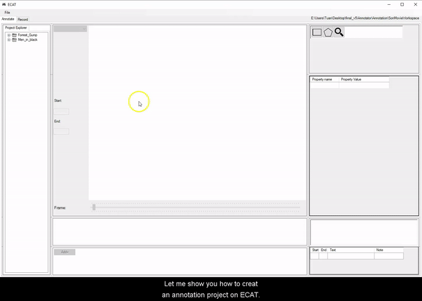

## ECAT

# System requirements

1. Windows >= 8.0

For capturing using Kinect

2. Kinect v2 for Windows

3. Desktop/laptop that support a dedicated USB 3.0 Controller (for Kinect V2 connection).

# Demo

Annotating of objects on an .mp4 file

[Object annotation demo](miscellanous/Object_annotation.mp4)

# Tutorial

Please refer to the [project's wiki](https://github.com/tuandnvn/ecat/wiki)
# Prerequisites

1. Microsoft Kinect v2 SDK https://www.microsoft.com/en-us/download/details.aspx?id=44561

